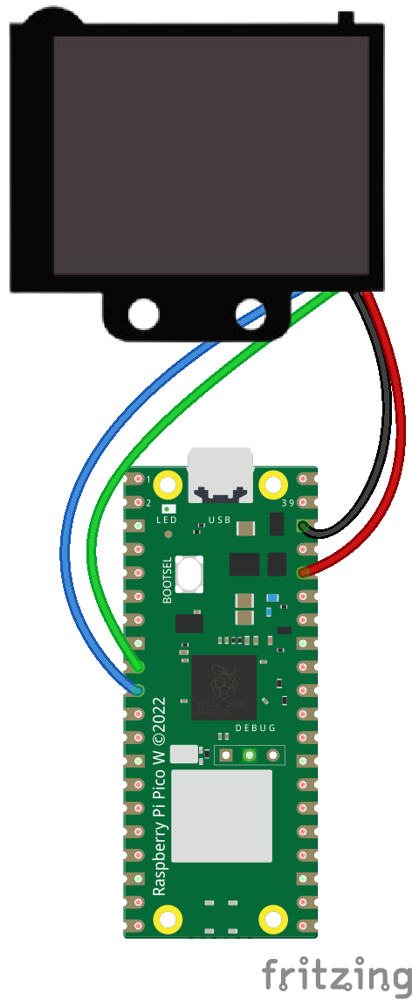

Módulo y ejemplos para usar en HuskyLens desde Raspberry Pi Pico de [este repositorio](https://github.com/antonvh/PyHuskyLens/)
Conecta la Raspberry Pi Pico con las HuskyLens siguiente el siguiente esquema

| HuskyLens | Raspberry Pi Pico |
| --------- | ----------------- |
| Vcc       | 3.3V              |
| GND       | GND               |
| SDA       | GPIO6             |
| SCL       | GPIO7             |
