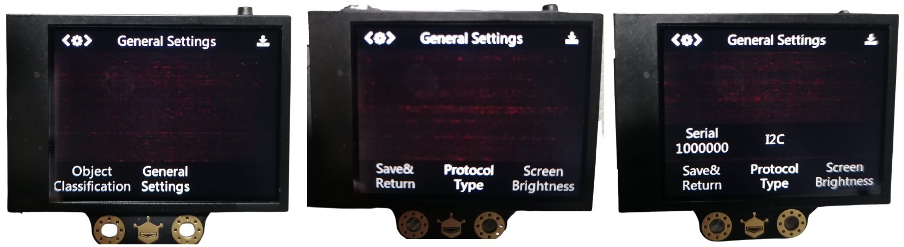

# HuskyLens y Raspberry Pi Pico

 by @javacasm & mLuz

El objetivo de este tutorial es aprender a controlar una cámara [HuskyLens](https://www.dfrobot.com/product-1922.html) desde una [Raspberry Pi Pico](https://www.raspberrypi.com/products/raspberry-pi-pico/) usando [MicroPython](https://micropython.org/).

En la imagen se ven varias caras reconocidas y con datos aportados por la Pico, como su ID  la posición (x,y) donde se detectan.

Para realizar este tutorial suponemos que...
1. Tenemos actualizada el firmware de la HuskyLens.
2. La Pico tiene instalado su firmware de MicroPython .
3. Tenemos instalado en el PC el entorno de programación de Python [Thonny](https://thonny.org)

Ahora vamos con la conexión del montaje, recordando que ambos equipos tanto la Pico como las cámara HuskyLens, han de estar apagada y sin conexión alguna al PC. Las HuskyLens no estarán conectadas al USB, se alimentan desde la Pico.

1. Conectamos la Raspberry Pi Pico con las HuskyLens, utilizando el cable incluido, un extremo en el conector Grove de la HuskyLens y el otro , siguiendo el esquema (hemos utilizado los colores de los cables de nuestras HuskyLens). 

| HuskyLens | Raspberry Pi Pico |
| --------- | ----------------- |
| Vcc       | 3.3V              |
| GND       | GND               |
| SDA       | GPIO6 (SDA)       |
| SCL       | GPIO7 (SCL)       |

2. Conectamos el cable USB desde la Pico a tu PC.

Si todo ha ido bien las HuskyLens se encenderán. Ahora vamos a memorizar la cara que queremos reconocer si aún no lo has hecho. 
1. Seleccionamos el puerto I2C en su configuración general de parámetros en el tipo de Protocolo de comunicaciones

2. Usaremos una imagen con múltiples caras para poder memorizar varios rostros. Enfocamos la cámara a la cara que queremos memorizar y pulsamos el botón Aprendizaje. 

3. Aparecerá identificada como ID:1
4. Si queremos memorizar más caras sólo tenemos que seguir el proceso que ya vimos.

Ahora vamos con la programación:
1. Descarga la [librería y el código](https://github.com/javacasm/Pico-HaskyLens/archive/refs/heads/main.zip) (es algo largo para copiarlo a mano)
2. Descomprime el fichero zip.
3. Una vez abierto el programa Thonny, abrir la ventana Archivos con la opción "Visualizar -> Archivos"

4. Selecciona el directorio donde has descomprimido el archivo Zip

5. Selecciona el intérprete y el puerto dónde tienes conectada tu Pico

6. Marca los ficheros "pyhuskylens.py" y "test_1_pyhuskyLens:py" del PC y seleccionamos la opción "Subir a /" (botón derecho del ratón) con lo que se enviarán a la Pico.

7. Si todo ha ido bien tendremos los ficheros en la Pico

8. Abrimos el código fichero test_1_pyhuskyLens.py en Thonny
9. Pulsamos "Ejecutar"

10. En la HuskyLens aparecerá el mensaje "Hola, soy la Pico" durante unos segundos

11. Cuando reconozca una cara se encenderá el LED de la placa, y como vemos en la imagen al reconocer una cara se muestra tambien la etiqueta asociada y las coordenadas (x,y) donde se detecta

## Reconocimientos

Módulo y ejemplos basados en [este repositorio](https://github.com/antonvh/PyHuskyLens/)
[Documentación de HuskyLens](https://learn.dfrobot.com/makelog-308564.html)
[Machine Vision with HuskyLens](https://dronebotworkshop.com/huskylens/) y su [vídeo](https://youtu.be/E140gPLPz4A) by Will de DroneBot Workshop
[Github de HuskyLens](https://github.com/HuskyLens)